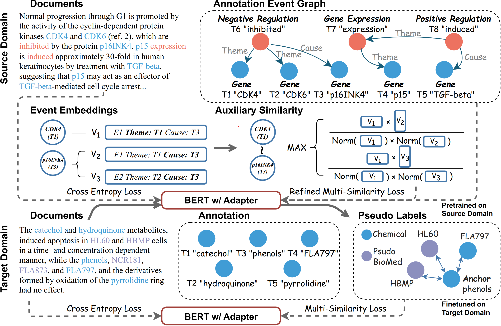

# Named Entity Recognition Under Domain Shift via Metric Learning for Life Sciences  

Accepted by NAACL 2024

## Overview



# Requirements

### Environments

* Python 3.8 (Ubuntu 20.04)

* PyTorch 1.11.0 & CUDA 11.3

### Setups

Here is some basic steps to setup the environment.

Step1: Create an unique Conda environment and install Python and PyTorch with CUDA support of specified version. 

```shell
conda create -n [ENV_NAME] python=3.8
conda install pytorch torchvision torchaudio pytorch-cuda=11.3 -c pytorch -c nvidia
```

Step2: Install all the required Python packages for the repository by the following command:

```shell
pip install -r requirements.txt
```

Step3: Install NLTK data. Run the Python interpreter and type the following commands:

```python
>>> import nltk
>>> nltk.download("punkt")
```

### Datasets

All the datasets involved have been uploaded to Huggingface [Lhtie/Bio-Domain-Transfer](https://huggingface.co/datasets/Lhtie/Bio-Domain-Transfer). Download the datasets by typing the commands:

```bash
git lfs install
git clone https://huggingface.co/datasets/Lhtie/Bio-Domain-Transfer
```

The folder contains biomedical datasets `PathwayCuration`, `Cancer Genetics` ,`Infectious Diseases` and chemical datasets `CHEMDNER`, `BC5CDR`, `DrugProt`.

### Models

All the models used (`BERT`, `SapBERT`, `S-PubMedBert-MS-MARCO-SCIFACT`) can be download from  from Huggingface Repositories:

```bash
git lfs install
git clone https://huggingface.co/bert-base-uncased
git clone https://huggingface.co/cambridgeltl/SapBERT-from-PubMedBERT-fulltext
git clone https://huggingface.co/pritamdeka/S-PubMedBert-MS-MARCO-SCIFACT
```

## Quickstart

### Configurations

* `dataConfig` contains data process scripts

	**DataConfig**:  Modify `dataset_dir` from `dataConfig/config.py`: directory  path to datasets (eg. `./Bio-Domain-Transfer`)

	**ModelConfig**: Modify `sapbert_path`, `sentbert_path`, `bert_path` from `dataConfig/confg.py`: directory path to models respectively

* `configs/para` contains configuration files for different experiment senarios

  `few-shot_bert.yaml`: Target Only

  `oracle_bert.yaml`: Target Only with full training data

  `transfer_learning.yaml`: Direct Transfer

  `transfer_learning_eg.yaml`: EG (Fill in `DATA.BIOMEDICAL.SIM_METHOD` to switch between `concat` and `sentEnc`)

  `transfer_learning_disc.yaml`: ED

  `transfer_learning_eg_disc.yaml`: EG+ED

### Run

**Train**

Run the `train.py` script (Multi-Processing) by the following command:

```shell
torchrun --nnodes=1 --nproc_per_node=<# gpus> train.py \
	--cfg_file <configuration file> \
```

**Test**

Run the `eval.py` script to test finetuned models:

```shell
python eval.py --cfg_file <configuration file>
```

### Citation

```
@misc{liu2024tagging,
      title={Name Tagging Under Domain Shift via Metric Learning for Life Sciences}, 
      author={Hongyi Liu and Qingyun Wang and Payam Karisani and Heng Ji},
      year={2024},
      eprint={2401.10472},
      archivePrefix={arXiv},
      primaryClass={cs.CL}
}
```

